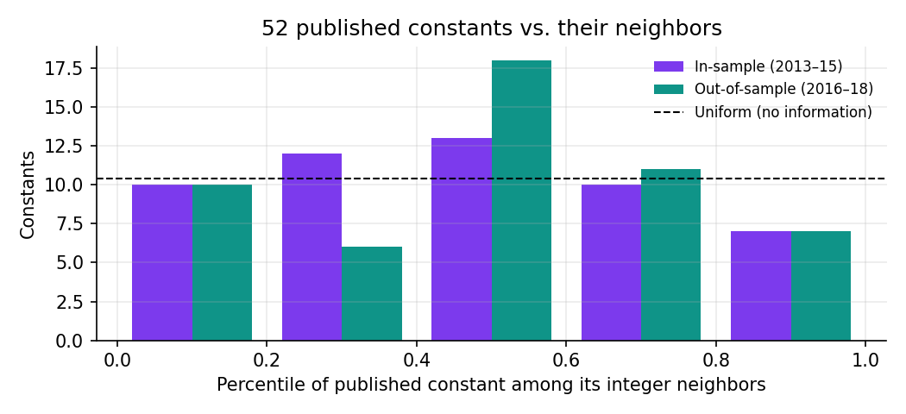
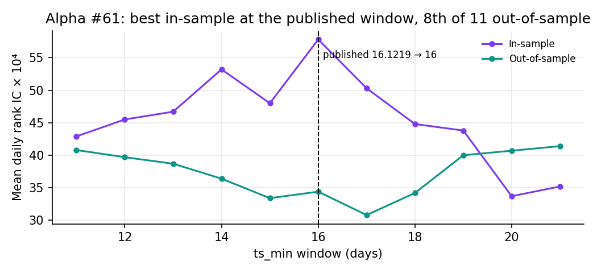
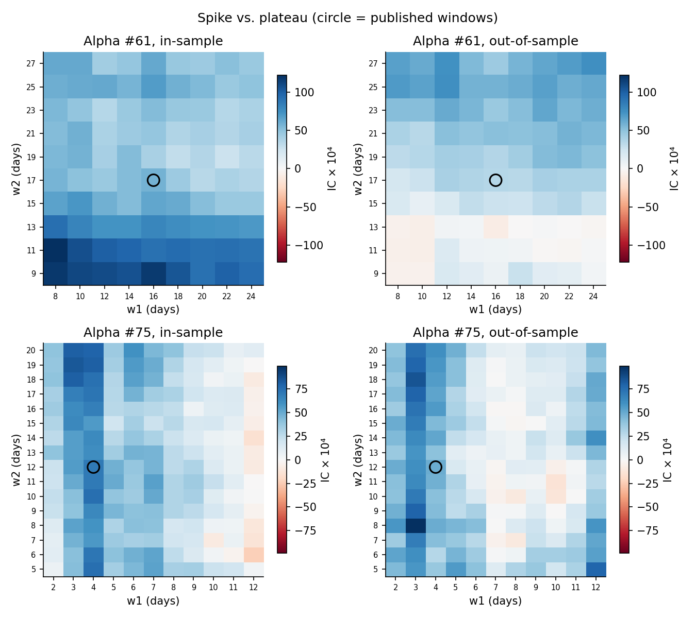
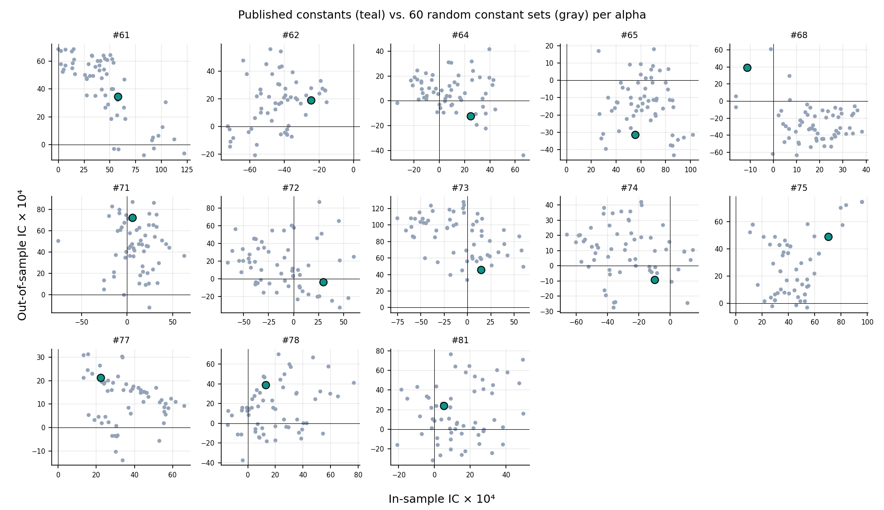

# Stress-Testing the Constants in 101 Formulaic Alphas

Many alphas in Kakushadze's [*101 Formulaic Alphas*](https://arxiv.org/abs/1601.00991) (2016) use constants like `9.91009` and `0.00817205`. This project re-implements 13 of them in pandas and tests whether those exact numbers carry signal on independent data, or whether they are fingerprints of an automated search fit to data we never see.

**Interactive write-up:** [elaine-wu.vercel.app/projects/alpha101-constants](https://elaine-wu.vercel.app/projects/alpha101-constants)

## TL;DR

- **The constants are not local optima on fresh data.** Across 52 constants in 13 alphas, the published value was the best of its integer neighbors in-sample only 4 times. Its average neighborhood percentile was 49%, a coin flip.
- **Random constants do about as well.** The published constants beat random ones 58% of the time in-sample and 49% out-of-sample.
- **Picking the in-sample best backfires.** For Alpha #61, in-sample and out-of-sample IC across window pairs have a correlation of −0.75. Pooled over every random draw, the correlation is −0.17.
- **One alpha survives.** Alpha #75, the simplest one tested, is the only signal with an in-sample IC t-stat above 2 (3.2), holds up out-of-sample (1.8), and sits on a broad plateau.
- **Floor vs. round matters.** The paper floors fractional windows. Floor and round disagree on 24 of 46 windows here, and switching flips the sign of Alpha #72 and #73 in-sample.

## Why the constants look machine-made

The paper says non-integer windows are floored, so `correlation(x, y, 9.91009)` is just a 9-day correlation and five of the six significant figures do nothing. The formulas also contain expressions no one would write by hand:

| Alpha | Expression | Simplifies to |
|---|---|---|
| #66 | `(low * 0.96633) + (low * (1 - 0.96633))` | `low` |
| #82 | `(open * 0.634196) + (open * (1 - 0.634196))` | `open` |
| #77 | `(((high + low) / 2) + high) - (vwap + high)` | `(high + low) / 2 - vwap` |
| #62 | `rank(open) + rank(open)` | `2 * rank(open)` |

These look like the output of a genetic-programming search over an expression grammar.

## Setup

- **Data:** daily OHLCV for 505 S&P 500 constituents, Feb 2013 to Feb 2018 (the widely mirrored Kaggle "S&P 500 stock data" set). VWAP is proxied by the typical price `(high + low + close) / 3`; `adv{d}` is the d-day mean dollar volume.
- **Split:** in-sample through Dec 2015, out-of-sample from Jan 2016, when the paper appeared on arXiv.
- **Alphas:** #61, 62, 64, 65, 68, 71, 72, 73, 74, 75, 77, 78, 81. Each has several fractional constants and none needs industry neutralization.
- **Timing:** signal computed at the close on day t, traded open t+1 to open t+2 (no look-ahead).
- **Metrics:** mean daily Spearman rank IC (the main metric, since many alphas output only 0/±1), plus Sharpe and turnover of a dollar-neutral portfolio weighted by the signal's demeaned cross-sectional rank, before costs.

## Results

### Baseline (published constants)

| Alpha | IS IC ×10⁴ | IS t | IS Sharpe | OOS IC ×10⁴ | OOS t | OOS Sharpe | Turnover |
|---|---:|---:|---:|---:|---:|---:|---:|
| #61 | +57.8 | +1.69 | +0.51 | +34.4 | +0.98 | +0.76 | 12% |
| #62 | -24.6 | -0.95 | -1.09 | +18.9 | +0.58 | -0.25 | 28% |
| #64 | +24.6 | +0.67 | +0.12 | -12.2 | -0.29 | +0.35 | 17% |
| #65 | +55.5 | +1.88 | +1.05 | -31.3 | -0.82 | +0.42 | 20% |
| #68 | -11.3 | -0.39 | -0.94 | +39.2 | +1.10 | +0.21 | 33% |
| #71 | +5.9 | +0.16 | -0.24 | +72.5 | +1.96 | +1.83 | 37% |
| #72 | +29.5 | +1.14 | +0.32 | -3.7 | -0.12 | +0.07 | 21% |
| #73 | +14.6 | +0.44 | +0.54 | +46.0 | +0.99 | +0.56 | 38% |
| #74 | -9.8 | -0.42 | -0.91 | -9.1 | -0.31 | -0.20 | 13% |
| #75 | +70.1 | +3.20 | +1.21 | +49.0 | +1.80 | +1.22 | 24% |
| #77 | +22.2 | +0.77 | +0.47 | +21.2 | +0.53 | +0.56 | 25% |
| #78 | +12.9 | +0.50 | -0.10 | +39.1 | +1.21 | +0.79 | 24% |
| #81 | +5.3 | +0.23 | -0.35 | +24.1 | +0.85 | +0.43 | 20% |

### Experiment 1: move one constant at a time

Each window is swept over every integer within ±5 of its floored value, and each blend weight over a grid from 0 to 1, holding everything else fixed. If a constant were tuned to a real effect, the published value should sit near the top of its neighborhood. It doesn't: the distribution is flat.



Alpha #61's first window is the classic pattern: the published value is the in-sample peak, then ordinary out-of-sample.



### Experiment 2: plateau or spike?

Alpha #61's in-sample hot spot (short windows) turns into the worst region out-of-sample. The top 10% of window pairs by in-sample IC averaged +7 × 10⁻⁴ out-of-sample, against +34 × 10⁻⁴ for the grid overall. Alpha #75 is a broad plateau: 84% of window pairs are positive in both periods.



### Experiment 3: floor vs. round

Rounding erases Alpha #72's in-sample IC (+29.5 → −1.2), flips #73 negative (+14.6 → −12.5), and cuts #61 by about 30%. Two implementations that both claim to follow the paper can report different results for the same alpha. Full numbers are in `results/results.json` under `round`.

### Experiment 4: random-constant null

Keep each alpha's structure, replace its constants with random draws (windows uniform from half to double the published length, weights uniform on [0, 1]), 60 draws per alpha.



## Takeaway

On independent data the six-digit precision buys nothing; any value in these formulas lives in their structure. This does not show the alphas were overfit on WorldQuant's own data, which isn't public, only that the specific numbers don't transfer. Selecting constants by in-sample IC actively hurt out-of-sample IC, and the one robust signal was the simplest.

## Reproduce

```bash
pip install -r requirements.txt
mkdir -p data
curl -sSL -o data/all_stocks_5yr.csv https://raw.githubusercontent.com/plotly/datasets/master/all_stocks_5yr.csv
python3 sweep.py          # ~20 min on 2 cores, writes results/results.json
python3 make_figures.py   # writes figures/*.png
```

| File | Purpose |
|---|---|
| `operators.py` | The paper's operators (`rank`, `ts_rank`, `correlation`, `decay_linear`, ...). Fractional windows are floored or rounded via `set_window_mode`. |
| `alphas.py` | The 13 alphas with every constant exposed as a keyword argument, defaults copied from the paper. |
| `evaluate.py` | Daily rank IC and the dollar-neutral rank-weighted portfolio. |
| `sweep.py` | All experiments. |
| `make_figures.py` | README figures. |

## Caveats

The universe is the S&P 500 as of 2018, so it carries survivorship bias. VWAP is approximated from daily bars, returns ignore transaction costs, and the out-of-sample window is about two years. The paper's alphas were built for a broader universe and likely intraday VWAP, so weak ICs here are not a claim that they failed in production. Research exercise only, not investment advice.
